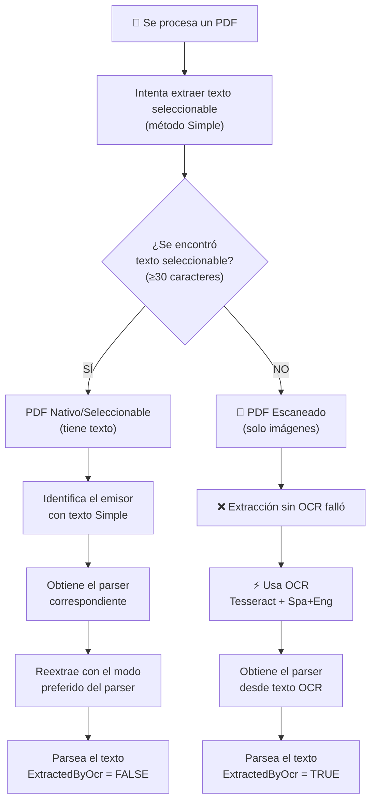

```mermaid
graph TD
    A["📄 Se procesa un PDF"] --> B["Intenta extraer texto seleccionable<br/>(método Simple)"]
    B --> C{"¿Se encontró<br/>texto seleccionable?<br/>(≥30 caracteres)"}
    
    C -->|SÍ| D["PDF Nativo/Seleccionable<br/>(tiene texto)"]
    C -->|NO| E["🚨 PDF Escaneado<br/>(solo imágenes)"]
    
    D --> F["Identifica el emisor<br/>con texto Simple"]
    F --> G["Obtiene el parser<br/>correspondiente"]
    G --> H["Reextrae con el modo<br/>preferido del parser"]
    H --> I["Parsea el texto<br/>ExtractedByOcr = FALSE"]
    
    E --> J["❌ Extracción sin OCR falló"]
    J --> K["⚡ Usa OCR<br/>Tesseract + Spa+Eng"]
    K --> L["Obtiene el parser<br/>desde texto OCR"]
    L --> M["Parsea el texto<br/>ExtractedByOcr = TRUE"]
```